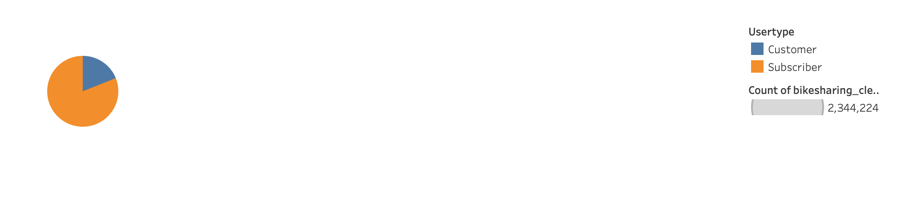
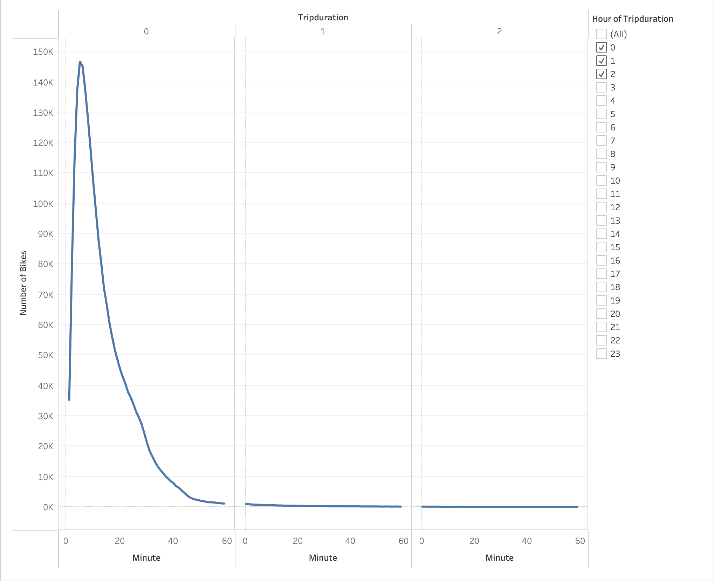
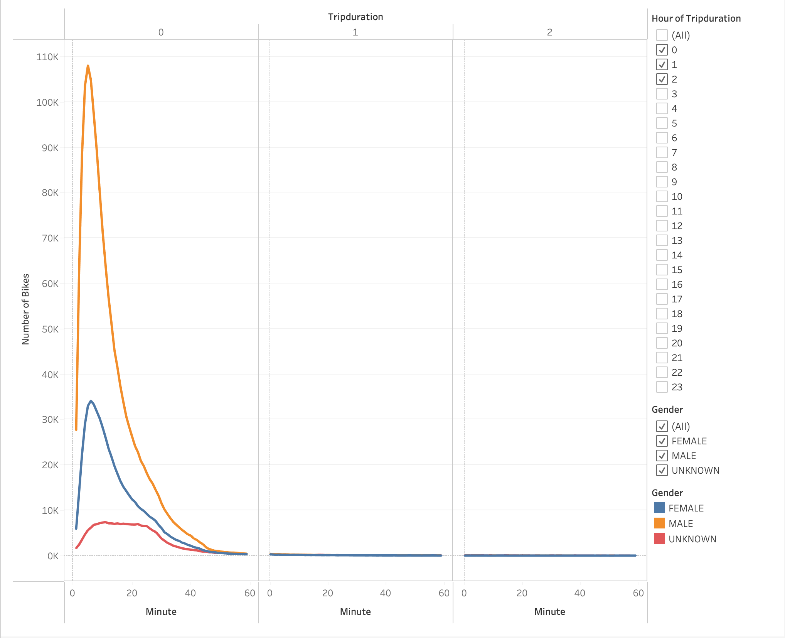
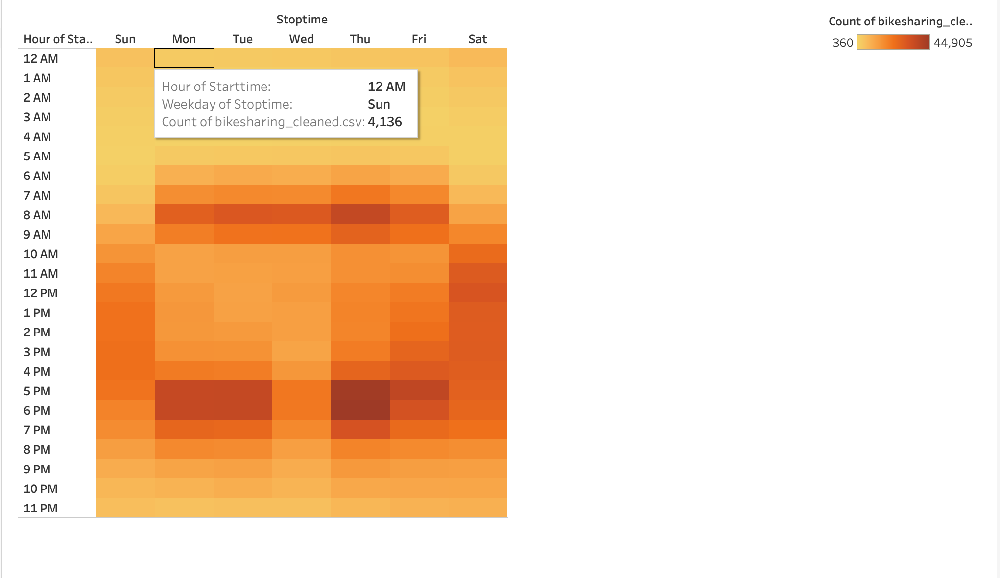
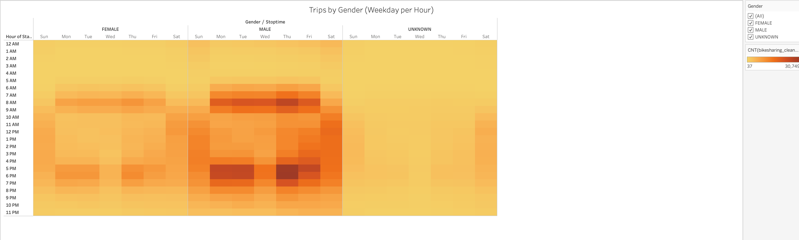
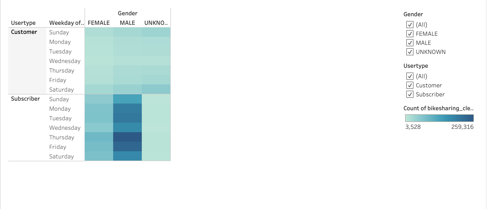
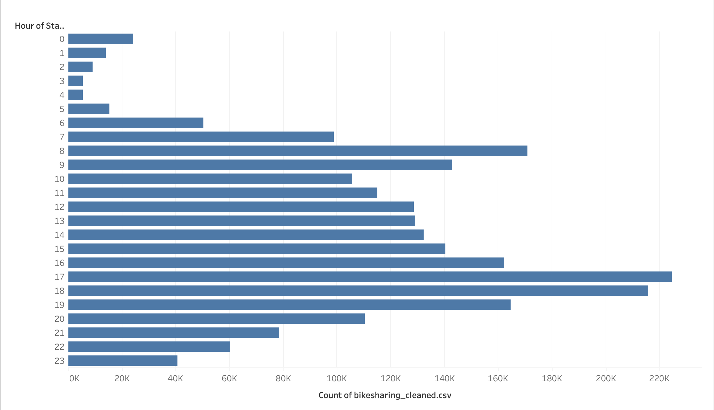

# Citi Bike Sharing

## Overview:

In this project, I created a bike trip analysis to convince investors that a bike-sharing program in Des Moines is a solid business proposal. To achive it, firstly, I used Pandas to change the "tripduration" column from an integer to a datetime datatype. Then, using the converted datatype, I created a set of visualizations to:

- Show the length of time that bikes are checked out for all riders and genders
- Show the number of bike trips for all riders and genders for each hour of each day of the week
- Show the number of bike trips for each type of user and gender for each day of the week.

The analysis for this project has been published to Tableau Public (https://public.tableau.com/profile/bradley.cao#!/vizhome/CitiBikeSharing/CitiBikeSharing?publish=yes) 
## Results:

- Customer Types: from the pie chart, we can see that most of the users, 81% (1,900,359 users) of them, are the app's subscribers.

- Checkout Times for Users: most of the trip lasts around 15 minutes, and then the trip duration steadily declines after that time mark.

- Checkout Times by Gender: following the analysis of the trip duration, we can see Male uses the bike the most in terms of Gender Type.

- Trips by Weekday for Each Hour: we see a trend that during Weekdays, except Wednesday, most users use the bike from 5 pm to 6 pm. The second most usage hours during Weekdays are at 8 am.

- Trips by Gender (Weekday per Hour): adding up with the above analysis, we can see that Male use the bike program more than any other Gender Type.

- User Trips by Gender by Weekday: subscribers who are male use the bike program more than anyone, especially during Thursday.

- August Peak Hours: the bar graph shows us that the peak hours are in the morning when they start going to work (7 am), and in the evening when they get out of work (from 5 pm to 7 pm, with 6 pm is the most popular time slot).

## Summary:

In conclusion, I think the program can be successful when deploys in Des Moines. From the results of this analysis, we can see that users are willing to subscribe to the program. Besides, the majority of the customer base is male, so we can focus our marketing effort on them. 

For future analysis, I would recommend two visualizations that focus on the user's demographic information:
- The Average Age of the customer base.
- The population density of the Des Moines area to understand where we should install the bike station.
